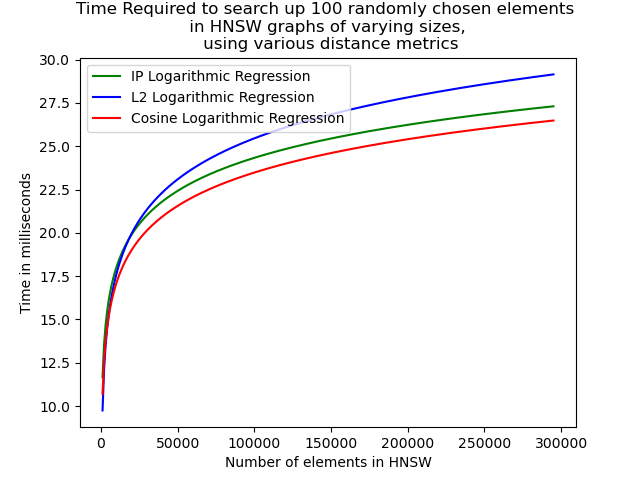

# HNSW-Discrete-Project-
This repo contains the code for our implementation of the HNSW algorithm (Hierarchical Navigable Small Worlds) for our CS 2051 Math paper.

I, Ankith, will eventually create a python file that measures the performance of a specific hnsw algorithm in querying a vector database for the nearest neighbours.

## Logarithmic Regression

Using the logarithmic function $y = a \log_{2}(x) + b$ I calculate the parameters that best fit each of the graphs created by the varying distance metrics. The graphs are in the figures folder.

### Cosine
**a**: 1.9052

**b**: -8.46 
### Inner Product
**a**: 1.90521

**b**: -7.31
### L2
**a**: 2.3636

**b**: -13.8
The logarthmic regression functions are seen here.
